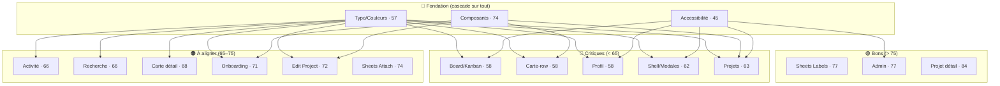

# 📊 Rapport d'Audit UI — Boardly (Pine Teal · iOS)

**Date : 2026-07-04**
**Méthode :** 15 agents Senior UI Designer en parallèle, une zone chacun, comparaison écran-par-écran vs la source de vérité pixel `Boardly Prototype.dc.html` + règles Boardly + HIG iOS 18 + WCAG 2.1 AA.
**Score de cohérence global : 67 / 100** — solide sur l'ossature (tokens sémantiques utilisés partout, aucun `Color.red` dans les composants partagés, `SheetHeader`/`AvatarView`/`boardlyField` factorisés), mais **plombé par la couche fondation** (fond & rampe de texte faux, tokens type/couleur manquants) et **l'accessibilité (45/100)**.

> ⚠️ **La plupart des écrans héritent de 5 défauts de fondation.** Corriger la fondation (`Boardly_UI_Fixes.swift`) remonte mécaniquement la quasi-totalité des zones. Priorité absolue : la fondation, puis l'accessibilité.

---

## 🔴 Incohérences critiques (P0) — systémiques, forte fréquence

| # | Incohérence | Occurrences | Racine | Correction |
|---|---|---|---|---|
| 1 | **Cibles tactiles < 44pt** sur les boutons icône-seule (back, `+`, `ellipsis`, `xmark`, filtre, trash, send) **+ 0 `accessibilityLabel` dans toute l'app** | ~11 zones | par-écran | `.frame(width:44,height:44).contentShape(Rectangle())` + `.accessibilityLabel(...)` → helper `.tapTarget()` |
| 2 | **Ombre de carte remplacée par un trait** (`.stroke(boardlySeparator,0.5)` au lieu de `shadow 0 1 3 .06`) | 5 types de cartes (foundation, projets ×2, projet-détail, carte-kanban) | `.boardlyCard` | rétablir l'ombre dans le modifier partagé |
| 3 | **Titre d'écran = token `boardlyTitle` (Manrope 26 bold)** au lieu de **32 ExtraBold** — aucun token dédié n'existe | Projets, Recherche, Activité, Profil, (Board) | fondation typo | nouveau token `boardlyScreenTitle = sans(32,.heavy)` |
| 4 | **Boutons primaires/secondaires en `Capsule()`** (arrondi total) au lieu de **radius 15**, hauteur ~51 au lieu de **54**, police **16 au lieu de 17** | tous les CTA de l'app | `boardlyPrimary/Secondary` | `RoundedRectangle(15)` + `minHeight:54` + `sans(17,…)` |
| 5 | **Tokens couleur faux/manquants** : `BoardlyBackground` = **#E7E5DF/#0B0C0E** au lieu de **#F4F2EE/#1d1f24** ; rampe texte décalée (le "secondary" = #76726b est en réalité le *tertiaire* ; `#55524c` absent) ; **aucun `boardlyDestructive` #B0413E** (→ `labelRose` #B05C72 détourné) ; manquent teal-fill/neutral/muted/grabber/chevron/empty-ring + 2 labels (Priorité #C0823E, Bloqué #B0413E) → hardcodés en écran | fondation (cascade) | corriger les `.colorset` + ajouter les tokens |
| 6 | **Contraste WCAG AA échoué** : tertiaire #a8a49c ≈ **2:1**, secondaire #76726b ≈ **3.8:1** sur fond beige, pastilles amber #C0823E ≈ **3.2:1** & vert #6F8B57 ≈ **3.8:1** (texte blanc) | global | fondation couleurs | assombrir les tokens texte + les 2 labels clairs |
| 7 | **Meta de ligne rendue en JetBrains Mono** (`boardlyMonoCaption`) alors que le prototype la rend en **Manrope sans** (le mono est réservé aux labels de section uppercase) | carte-row, projets, board, projet-détail, recherche | usage token | `.font(.sans(12))` pour la meta ; mono = sections uniquement |

---

## 🟠 Incohérences majeures (P1) — par zone

| Incohérence | Zone(s) | Correction |
|---|---|---|
| `.presentationCornerRadius(26)` absent (sheets système ~10) alors qu'`EditProjectSheet` l'applique | 5 card-sheets | `.presentationCornerRadius(26)` |
| `SheetHeader` : titre **16 bold** au lieu de **17 ExtraBold** ; bouton OK **600** au lieu de **700** | toutes les sheets | `sans(17,.heavy)` / `doneLabel` 700 |
| Couleurs brutes : `.red`/`.orange` (onboarding), `.yellow.opacity(0.4)` (surlignage recherche — échoue AA), `labelGreen` pastille non-lu (activité, doit être accent) | onboarding, recherche, activité | tokens `boardlyDestructive`/`boardlyWarning`/`accentColor` |
| Case sous-tâche = cercle SF + vert au lieu de **carré radius 7 + fond accent + check blanc** | carte-détail | `RoundedRectangle(7)` accent |
| Panneau contenu carte-détail : **radius-top 22 + chevauchement -18 absent** ; titre **26** au lieu de **23/800 tracking -.02em** | carte-détail | nouveau token `boardlyDetailTitle` + panneau arrondi |
| Board : **pastille couleur de liste** + **bouton "+" par colonne** absents ; badge count faux (mono/couleur/fond/forme) ; segmented control (police/padding/radius/ombre/fond) ; gutters 20 au lieu de 16 | board/kanban | voir tableau zone |
| "Nouvelle carte" en **`.alert` système** au lieu de bottom-sheet Boardly ; "Filtres" **non implémenté** (icône décorative) | shell | `.sheet` + chrome Boardly |
| Profil : **tuiles d'icône teintées absentes** (30pt/radius 9/#E2EFEC) ; **Log Out** en capsule rose plein au lieu de ligne-carte texte rouge | profil | tuile + ligne-carte destructive |
| Champ perso réinvente `boardlyField()` (radius 11 vs 12) ; input focus sans bordure accent 1.5 | sheets, onboarding | réutiliser `boardlyField()` + `@FocusState` |
| Carte-kanban : **chip timer (stopwatch)** + **cover 80px** non rendus | carte-row | ajouter les deux éléments conditionnels |
| Deltas 1–2px récurrents : avatars 26/22 vs 28/24, largeur favori 170 vs 158, bande couleur 5 vs 6/7, radius carte 14 vs 15/16 | projets, projet-détail, activité… | alignement pixel |

---

## 🟢 Points forts (à préserver)

- **Tokens sémantiques utilisés partout** — aucune couleur brute dans `BoardlyComponents`, `PlankaLabelColor`/`PlankaGradient` propres (`Color(hex:)` = données PLANKA figées, légitime).
- **Composants factorisés** : `SheetHeader` + grabber, `AvatarView`, `boardlyField`, `BoardlyFieldLabel`, styles de bouton — réutilisés (les 3 card-sheets et les 3 écrans admin ne driftent pas entre eux).
- **Accent `#1F7A6B`/`#4FB3A1` pixel-exact** ; 5 labels sur 7 exacts.
- **Dynamic Type** : le texte passe par `.sans/.mono(relativeTo:)` → il scale (les `.system(size:)` restants sont des glyphes SF, acceptable).
- `EditProjectSheet` et le FAB/TabView sont conformes à la chrome spec.

---

## 📈 Score par zone

| Zone | Score | Faiblesse dominante |
|---|---:|---|
| Projet détail | 84 | rayons 14→15, meta mono→sans |
| Sheets Labels/Membres/Échéance | 77 | SheetHeader 16→17, rayon 26 absent |
| Admin (Webhooks/SMTP/Notif) | 77 | séparateurs/empty-states/tokens de ligne divergents, icônes <44 |
| Fondation composants | 74 | boutons `Capsule()`, ombre carte manquante |
| Sheets Attachments/Custom fields | 74 | rayon 26 absent, input réinventé, icônes <44 |
| Edit Project Sheet | 72 | header hors gabarit, cibles <44 |
| Onboarding / Auth | 71 | `Capsule()`, `.red`/`.orange`, hero login absent |
| Carte détail | 68 | panneau 22/chevauchement, titre 26→23, sous-tâches |
| Recherche | 66 | surlignage `yellow`, titre 26→32, chips capsule |
| Activité | 66 | ligne sans `.font()` (17pt), pastille `labelGreen` |
| Projets | 63 | titre 26→32, radius 14→16, search bar ombré |
| Shell / Modales | 62 | Nouvelle carte en `.alert`, Filtres absent |
| Board / Kanban | 58 | dot liste + `+` colonne absents, badge/segmented faux |
| Carte-row (kanban) | 58 | ombre→trait, meta mono, timer/cover absents |
| Profil | 58 | tuiles icône absentes, Log Out, destructif `labelRose` |
| **Fondation typo/couleurs** | **57** | **fond faux, rampe décalée, tokens type/couleur manquants** |
| **Accessibilité (transverse)** | **45** | **0 `accessibilityLabel`, cibles <44, contraste AA** |

---

## 🗺️ Carte de chaleur (écrans les plus divergents)

---

## ✅ Plan d'action recommandé (ordre)

1. **Fondation couleurs** — corriger `BoardlyBackground` (#F4F2EE/#1d1f24), la rampe de texte, ajouter `BoardlyDestructive` + les tokens manquants + 2 labels. *(Cascade sur toutes les zones + résout des échecs WCAG.)*
2. **Fondation typo** — ajouter `boardlyScreenTitle` (32/800), `boardlyDetailTitle` (23/800), `boardlySheetTitle` (17/800), `boardlySectionTitle` (13/700) + un `ViewModifier` mono-label (tracking+uppercase).
3. **Composants** — boutons `RoundedRectangle(15)`/54/17, ombre dans `.boardlyCard`, `SheetHeader` 17/800, `SelectionToggle` 24/anneau #D4D0C8, `BoardlyChip`, tuile d'icône teintée, helper `.tapTarget(44)`.
4. **Accessibilité** — `accessibilityLabel` sur tous les contrôles icône-seule + `.tapTarget()` partout.
5. **Modales manquantes** — "Nouvelle carte" et "Filtres" en bottom-sheet.
6. **Deltas pixel par zone** — voir les tableaux détaillés de chaque agent.

Le fichier **`Boardly_UI_Fixes.swift`** fournit 1→3 prêts à l'emploi (racine).
