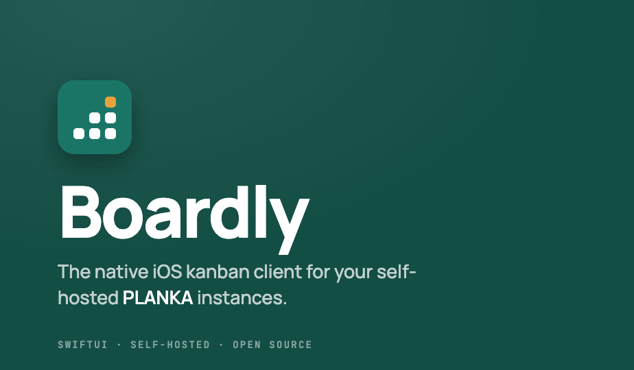
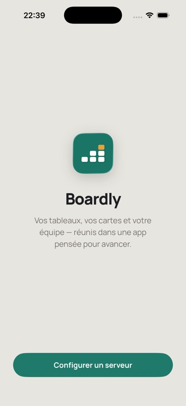
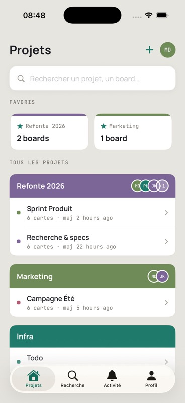
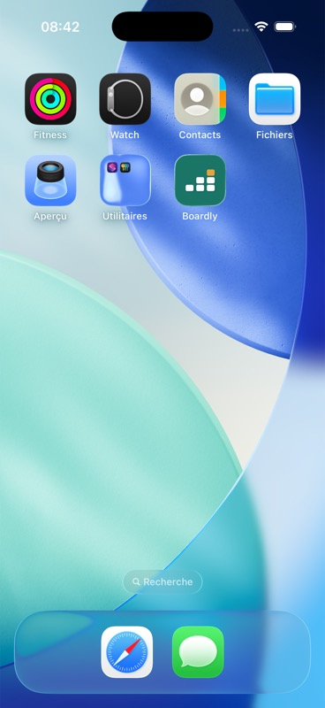
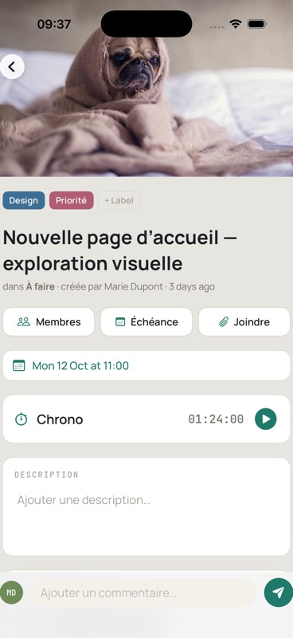

<div align="center">



# Boardly

### Your PLANKA boards, native on iPhone

Boardly brings your self-hosted [PLANKA](https://github.com/plankanban/planka) kanban boards to iPhone — fast, native, and updating in real time. There's **no middleman**: the app connects straight to *your* PLANKA server, so your data never passes through anyone else.

<br />

[](https://developer.apple.com/ios/)
[](https://developer.apple.com/xcode/swiftui/)
[](LICENSE)

</div>

---

## What is Boardly?

Boardly is a native iOS app for **PLANKA**, the open-source Trello-style kanban board. If you run your own PLANKA server, Boardly gives you a proper iPhone app for it — instead of pinching-and-zooming the website.

- 📱 **Native & fast** — built entirely in SwiftUI, it feels like it belongs on your phone.
- 🔗 **Connects to your server** — Boardly has no backend of its own. Every action talks directly to the PLANKA instance you choose, over a secure connection.
- 🗂️ **Many servers, one app** — juggle a work instance, a personal one, and a client's, each signed in separately.
- ⚡ **Real-time** — cards, lists, comments and members update live as your team works.
- 🔒 **Private by design** — your login stays in the iPhone Keychain and is only ever sent to your own server.

---

## Screenshots

| Sign in | Projects | Kanban board | Card detail |
| :-----: | :------: | :----------: | :---------: |
|  |  |  |  |

---

## Features

**Sign in & servers**
- Add, switch between, and remove multiple PLANKA **servers**
- Sign in with a **password** or **single sign-on (OIDC/SSO)** — works with providers like Authentik, Keycloak, Google, etc.
- Works with PLANKA hosted under a subpath (e.g. `https://example.com/planka`)
- Your token is stored securely in the **Keychain**, separately for each server

**Boards, lists & cards**
- Browse **projects → boards**, then work the board as a kanban
- Create and edit cards — title, description, **due date**, and drag between lists
- **Checklists / tasks** inside a card, tick them off as you go
- Pull to refresh anytime

**Real-time sync**
- Live updates while a board is open — new cards, moves, comments and members appear instantly
- Automatic reconnection when your connection drops

**Rich cards**
- **Labels**, **members**, and **due dates**
- **Comments** with a threaded conversation
- **Attachments** — files, photos, or links
- A built-in **stopwatch** and a per-card **activity feed**

**Find & follow**
- **Search** across cards, boards, and projects, with matches highlighted
- An **Activity** tab with your notifications, grouped by recency — mark one or all as read

**Make it yours**
- **Project backgrounds** — pick from 25 gradients or upload your own image
- **Appearance** — light, dark, or automatic
- Set your **home view** and **Markdown editor** preferences
- Manage your **notification services**

**For admins**
- Manage **webhooks** and **email (SMTP) settings** — shown only when you're an instance admin

**Crafted design**
- A custom "Pine Teal" look with the **Manrope** and **JetBrains Mono** typefaces, in light and dark

---

## Requirements

- An **iPhone on iOS 26** (or the iOS 26 Simulator)
- A reachable **PLANKA instance** and an account on it — Boardly does not host anything for you

---

## Getting started

Boardly isn't on the App Store yet, so you run it from source with **Xcode 26**:

```bash
git clone https://github.com/2rock-Inc/Boardly.git
cd Boardly
open Boardly/Boardly.xcodeproj
```

Pick an iPhone simulator (or your own device) and hit **Run**.

Then, in the app:

1. **Add a server** — enter your PLANKA address (e.g. `https://todo.example.com`).
2. **Sign in** — with your email/username and password, or tap **Continue with SSO** if your instance uses single sign-on.
3. You're in — your projects and boards load, and updates stream in live.

---

## Privacy & security

Boardly is built to keep your data yours:

- **No backend in the middle.** The app connects only to the PLANKA server you enter — nothing is routed through us.
- **Your login stays on your device.** Access tokens live in the iOS **Keychain**, scoped per server, never in plain storage.
- **Tokens go to your server only.** Your token is attached solely to requests to your own instance's secure origin, never to third-party links or images.
- **No secrets in logs.** Diagnostic logging is built so tokens and passwords can't leak into it.
- **Certificates matter.** Boardly doesn't silently bypass TLS problems.

---

## Roadmap

Boardly ships in phases (see [`ROADMAP.md`](ROADMAP.md) for detail):

- [x] Foundation — servers, secure sign-in, onboarding
- [x] Core kanban — projects, boards, cards, tasks
- [x] Real-time sync
- [x] Rich cards — labels, members, comments, attachments, due dates, stopwatch, activity
- [x] Account & admin — SSO, notifications, project backgrounds, webhooks & SMTP
- [x] Search & profile preferences
- [ ] Custom fields on cards *(in progress)*

---

## For developers

Boardly is open source (MIT) and contributions are welcome.

- The networking core lives in a pure-Swift package, **`BoardlyKit`** (no UIKit/SwiftUI), so it builds and tests without Xcode:
  ```bash
  swift build
  swift test
  ```
- The SwiftUI app follows a **Model-View** pattern with `@Observable` view models and a path-based `NavigationStack`. Models are generated from PLANKA's own OpenAPI spec (`Reference/planka-openapi.json`). The only third-party dependency is the Socket.IO client, scoped to real-time sync.
- Architecture notes, conventions, and the phase plan are in [`ROADMAP.md`](ROADMAP.md) and `CLAUDE.md`.

Feature work goes on a `feat/<slug>` branch and is squash-merged into `main` after a passing `swift test`. Commits use emoji conventional messages (e.g. `✨ feat(search): add board search`).

---

## License

Released under the [MIT License](LICENSE). © 2026 2rock Inc.

---

<div align="center">

Made with SwiftUI for the [PLANKA](https://github.com/plankanban/planka) community · by **2rock Inc.**

</div>
